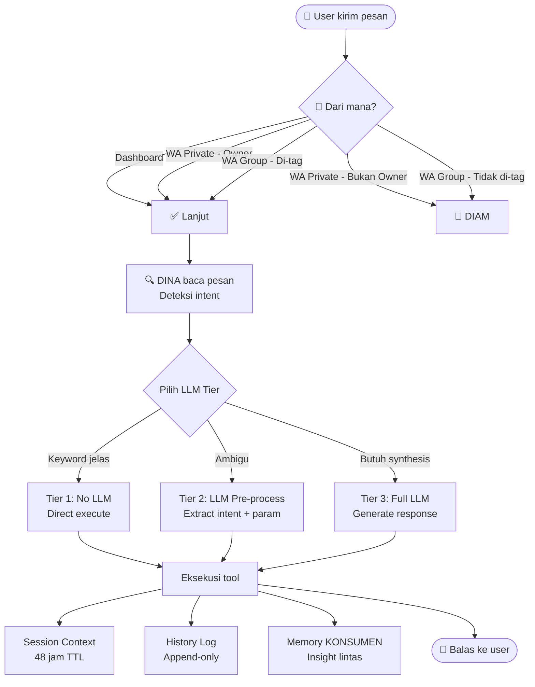
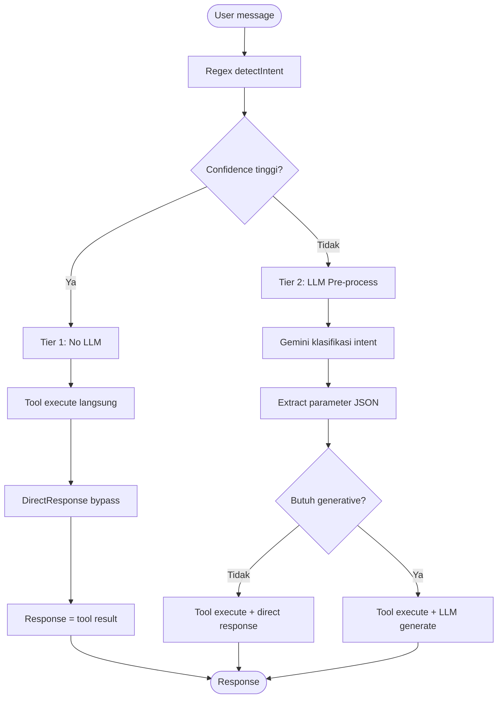
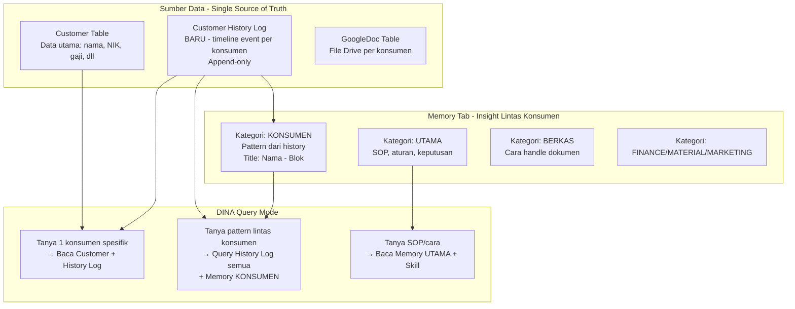
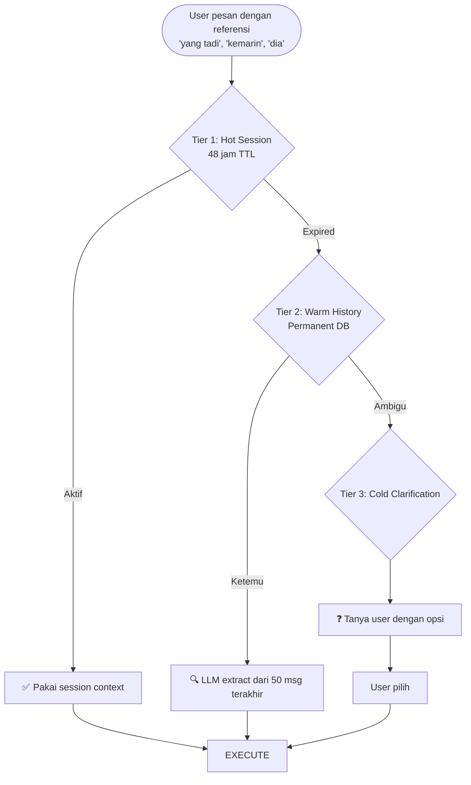
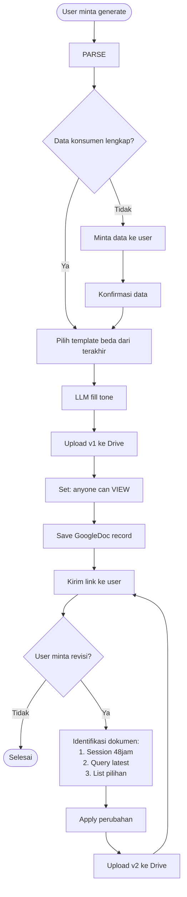

# DINA v2 — FINAL DESIGN DOCUMENT
**Project:** Hadi Kaya Virtual Office (PT. Marlindo Bangun Persada)
**Subsistem:** ANJAYO 16 — DINA (Document Intelligence & Notification Assistant)
**Versi:** 2.0 (Architecture Redesign)
**Tanggal:** 10 Juli 2026
**Status:** LOCKED — Ready for Implementation

---

## 0. EXECUTIVE SUMMARY

Dokumen ini adalah hasil dari 7+ putaran diskusi arsitektur yang menghasilkan 15 keputusan final (locked decisions). Dokumen ini menjadi single source of truth untuk implementasi DINA v2 dan migrasi dari arsitektur lama.

**Key realization:** DINA adalah **tool untuk user (owner + staff)**, BUKAN front-line agent yang berhadapan langsung dengan konsumen. Realisasi ini mengubah seluruh asumsi desain sebelumnya terkait auto-memory, auto-extract, dan tiered context.

**6 tujuan DINA:**
1. Intent & permission management (CRUD dengan safety)
2. Query pengalaman lintas konsumen (case lookup, pattern recognition)
3. Auto-process berkas dari WhatsApp (upload ke konsumen terkait)
4. Generate dokumen (SK Kerja, Slip Gaji, Laporan Keuangan, Logo)
5. Generate surat umum (dengan struktur folder Drive baru)
6. Status query konsumen (berkas, stage, bank pipeline)

---

## 1. SELF-REALIZATION — Apa yang Sebelumnya Salah

### Salah #1: Asumsi DINA berhadapan dengan konsumen
- **Sebelumnya:** Design auto-extract info konsumen dari chat
- **Realitas:** User (owner/staff) yang chat konsumen, lalu update ke DINA
- **Konsekuensi:** Tidak perlu auto-extract, tidak perlu privacy concern cross-agent

### Salah #2: Dual source of truth antara history log dan memory
- **Sebelumnya:** Tier 1 (field), Tier 2 (memory simplified), Tier 3 (working), Tier 4 (junk)
- **Realitas:** History log di Tab Berkas = single source of truth per konsumen; Memory Tab = insight lintas konsumen
- **Konsekuensi:** Tidak ada sync problem, tidak ada drift

### Salah #3: Over-engineer title collision
- **Sebelumnya:** Khawatir nama "Budi Santoso" akan collide
- **Realitas:** Dalam satu perumahan kecil, collision langka. Format title `[Nama] - [Blok/No Rumah]` + disambiguation by status akad sudah cukup

### Salah #4: Format "simplified" yang vague
- **Sebelumnya:** Simplified version = latest state only
- **Realitas:** Timeline append-only dengan delta jelas: "Mar 2026: gaji naik jadi 5jt (dari 4.5jt)"

### Salah #5: Lupa tujuan #2 (query pengalaman lintas konsumen)
- **Sebelumnya:** Memory cuma untuk SOP dan rules
- **Realitas:** Memory dengan kategori KONSUMEN = tempat insight lintas konsumen untuk query analitik

---

## 2. DINA IDENTITY & 6 GOALS

### Identitas
| Atribut | Nilai |
|---|---|
| Nama | DINA (Document Intelligence & Notification Assistant) |
| Role | Document AI Assistant (TOOL untuk user) |
| Perusahaan | PT. Marlindo Bangun Persada |
| Direktur | Andrian Bong |
| Project | ANJAYO 16 (perumahan subsidi Pangkalpinang) |
| LLM Primary | Gemini 2.0 Flash |
| LLM Fallback | OpenRouter Nemotron |
| Channel | Dashboard + WhatsApp (owner only di DM, tag-required di grup) |

### 6 Tujuan DINA

| # | Tujuan | Status v1 | Status v2 |
|---|---|---|---|
| 1 | Intent & permission management | ✅ Ada | ✅ Enhanced dengan 3-tier LLM |
| 2 | Query pengalaman lintas konsumen | ❌ Belum ada | ✅ Baru — Memory KONSUMEN + History Log query |
| 3 | Auto-process berkas dari WhatsApp | ⚠️ Setengah | ✅ Diperbaiki dengan anti-overwrite |
| 4 | Generate SK/Slip/Laporan/Logo | ✅ Ada | ✅ Enhanced dengan hybrid template + versioning |
| 5 | Generate surat umum | ❌ Belum ada | ✅ Baru — folder Drive + intent baru |
| 6 | Status query konsumen | ⚠️ Setengah | ✅ Enhanced dengan History Log |

---

## 3. ARCHITECTURE OVERVIEW

### Diagram 1: High-Level Architecture (n8n-style)



### Diagram 2: 3-Tier LLM Strategy



### Diagram 3: Memory System (Single Source of Truth)



### Diagram 4: Session Context + Traceback



---

## 4. 3-TIER LLM STRATEGY

### Tier 1: TANPA LLM (Pure Deterministic)
**Trigger:** Keyword jelas, intent terstruktur
**Contoh:** "hapus konsumen Jenni", "ubah NIK Jenni jadi 1234", "daftar bank", "ya" (konfirmasi)
**Cara:** Regex `detectIntent()` → directResponse bypass
**Cost:** $0 per request

### Tier 2: LLM PRE-PROCESSING (Intent Understanding)
**Trigger:** Natural language, intent ambigu
**Contoh:** "Jenni kerja di mana?", "yang blok E5 gimana prosesnya?", "tolong cek Jenni dong"
**Cara:** Gemini Flash klasifikasi intent + extract parameter JSON
**Output:** Intent + parameter → tool execute → directResponse
**Cost:** ~$0.001 per call

### Tier 3: FULL LLM (Generative Response)
**Trigger:** Butuh synthesis, analisis, generation
**Contoh:** "ada konsumen kontrak lolos Mandiri?", "bikinin surat keterangan kerja untuk Jenni", "halo DINA"
**Cara:** Tool execute → Gemini generate natural response
**Cost:** ~$0.002 per call

### Tier Assignment per Task

| Task | Tier | Alasan |
|---|---|---|
| Delete confirmation | 1 | 1 kata, regex cukup |
| Update field dengan pattern jelas | 1 | Pattern terstruktur |
| Create customer dengan data lengkap | 1 | Format terstruktur |
| List banks / stats | 1 | Hardcoded query |
| Send file dengan docType jelas | 1 | Match docType |
| Permission reject | 1 | Hard rule |
| Natural language query | 2 | Butuh understanding |
| Vague intent | 2 | Butuh klasifikasi |
| Query pengalaman lintas konsumen | 3 | Butuh synthesis |
| Generate surat umum | 3 | Butuh generation |
| Analisis case | 3 | Butuh reasoning |
| Chat biasa / small talk | 3 | Natural conversation |
| Disambiguation phrasing | 3 | Natural response |

---

## 5. MEMORY SYSTEM (Redesigned)

### 5.1 Customer History Log (NEW)

**Tujuan:** Single source of truth untuk timeline per konsumen
**Format:** Append-only dengan delta jelas
**Storage:** Tabel baru `CustomerHistoryLog`

**Prisma Schema:**
```prisma
model CustomerHistoryLog {
  id          String   @id @default(cuid())
  customerId  String
  eventType   String   // FIELD_UPDATE, STAGE_CHANGE, DOC_UPLOADED, DOC_GENERATED,
                       // BANK_CHANGE, NOTE_ADDED, STATUS_CHANGE, INTERACTION
  title       String   // Short summary: "Gaji naik ke 5jt"
  description String   // Detail: "Diubah dari 4.5jt ke 5jt pada Mar 2026"
  oldValue    String?
  newValue    String?
  metadata    String?  // JSON: {field, source, agentId, ...}
  createdBy   String?  // userId atau agentId
  source      String   @default("MANUAL") // MANUAL | DINA | SYSTEM | WA
  createdAt   DateTime @default(now())
  
  customer Customer @relation(fields: [customerId], references: [id], onDelete: Cascade)
  
  @@index([customerId, createdAt])
  @@index([eventType])
}
```

**Contoh entries:**
```
| Date       | EventType     | Title                    | Description                                    |
|------------|---------------|--------------------------|------------------------------------------------|
| 2026-01-15 | STAGE_CHANGE  | DM → SURVEY              | Konsumen survey lokasi                         |
| 2026-02-01 | DOC_UPLOADED  | KTP diupload             | Via WA oleh owner                              |
| 2026-02-15 | FIELD_UPDATE  | Gaji naik ke 5jt         | Diubah dari 4.5jt ke 5jt                       |
| 2026-03-01 | STAGE_CHANGE  | SURVEY → CLOSING         | Konsumen putuskan beli                         |
| 2026-03-05 | DOC_GENERATED | SK Kerja v1 dibuat       | RAW - Jenni - SK Kerja v1.docx                 |
| 2026-03-10 | BANK_CHANGE   | Bank: BTN → Mandiri      | Switch karena BTN reject                       |
| 2026-03-15 | NOTE_ADDED    | KPR ditolak BTN          | Alasan: PE x 3 terlalu rendah                  |
```

### 5.2 Memory Tab — Kategori KONSUMEN (Enhanced)

**Tujuan:** Insight lintas konsumen untuk query analitik
**Bukan:** Duplikat history per konsumen

**Title format:** `[Nama Konsumen] - [Blok/No Rumah]`
**Contoh:** `Jenni - E5`, `Budi Santoso - F2`

**Contoh entries kategori KONSUMEN:**
```
Title: "Konsumen Blok 17 - Pattern Reject BTN"
Content: "3 dari 5 konsumen blok 17 KPR BTN ditolak. Alasan umum: PE x 3 terlalu rendah.
          Solusi: switch ke BSB Syariah (2 berhasil akad)."
Category: KONSUMEN
Importance: 0.9

Title: "Jenni - E5 - Case Study"
Content: "Jenni awalnya reject BTN (PE rendah), switch ke BSB Syariah, akad berhasil
          Maret 2026. Pattern: konsumen gaji 3-4jt lebih cocok BSB."
Category: KONSUMEN
Importance: 0.8
```

**Schema update:**
```prisma
model Memory {
  // ... existing fields
  customerId      String?  // existing, tetap loose (no FK)
  category        String   // UTAMA | BERKAS | FINANCE | MATERIAL | MARKETING | KONSUMEN
  // ... rest unchanged
}
```

### 5.3 Memory Query Paths

| Query Type | Source | Example |
|---|---|---|
| Tanya 1 konsumen spesifik | Customer + History Log | "Status Jenni?" |
| Tanya pattern lintas konsumen | History Log (all) + Memory KONSUMEN | "Ada konsumen kontrak lolos Mandiri?" |
| Tanya SOP/cara | Memory UTAMA + Skill | "Cara upload FLPP?" |

---

## 6. SESSION CONTEXT + TRACEBACK

### 6.1 Session Context (Tier 1 — Hot)

**TTL:** 48 jam, auto-renew setiap pesan
**Storage:** Tabel baru `SessionContext`

**Prisma Schema:**
```prisma
model SessionContext {
  id              String   @id @default(cuid())
  conversationId  String?
  channel         String   // DASHBOARD | WHATSAPP_PRIVATE | WHATSAPP_GROUP
  senderNumber    String?
  
  lastCustomerId   String?
  lastCustomerName String?
  
  // JSON array: [{docType, fileId, version, createdAt}]
  lastDocs        String?
  
  lastIntent      String?
  lastTopic       String?
  
  lastInteractionAt DateTime
  expiresAt       DateTime  // lastInteractionAt + 48 hours
  
  createdAt       DateTime @default(now())
  updatedAt       DateTime @updatedAt
  
  @@index([conversationId, channel, senderNumber])
  @@index([expiresAt])
}
```

### 6.2 Traceback Engine (Tier 2 — Warm)

**Trigger:** User pakai kata referensial:
- "yang tadi", "yang kemarin", "yang lalu"
- "dokumen itu", "konsumen tersebut", "dia"
- "lanjutin", "ubah lagi", "revisi"
- "sama kayak sebelumnya"

**Cara kerja:**
1. Cek SessionContext (48 jam)
2. Jika expired → query Message table (50 pesan terakhir)
3. Gemini Flash extract context: customer, docType, intent, parameter
4. Confidence >80% → pakai hasil
5. Confidence <80% → tanya user dengan opsi konkret

### 6.3 Cold Clarification (Tier 3)

**Trigger:** Traceback gagal atau ambigu
**Response:** DINA tanya user dengan list opsi konkret

**Contoh:**
```
User: "ubah dokumen yang lama"
DINA: "Aku nemu 5 dokumen Jenni di Drive:
1. RAW - Jenni - SK Kerja v3 (8 Mar) [link]
2. RAW - Jenni - SK Kerja v2 (5 Mar) [link]
...
Mau ubah yang mana? Balas angkanya."
```

---

## 7. GENERATE SK/SLIP/LAPORAN/LOGO (Enhanced)

### 7.1 Naming Convention
```
RAW - [Nama Debitur] - [Jenis Dokumen] - v[N].docx
```
**Contoh:** `RAW - Aldosietpu - SK Kerja dan Slip Gaji v1.docx`

**Prefix `RAW-`:** Versi mentah, belum ditandatangani
**Versi `vN`:** Versioning, tidak overwrite (sesuai rule "jangan timpa")

### 7.2 Versioning Strategy
- Setiap generate = versi baru (v1, v2, v3, ...)
- Versi lama tetap di Drive (tidak dihapus)
- DINA share link versi TERBARU saja
- User bisa lihat history versi di Tab Berkas

### 7.3 Hybrid Template + LLM Fill

**Pendekatan:** Template pool (5-10 per jenis) + LLM fill tone yang berbeda

**Template Pool Structure di Drive:**
```
📁 Templates/
├── 📁 SK Kerja/
│   ├── template-sk-01.docx  (format kantor formal)
│   ├── template-sk-02.docx  (format PT modern)
│   └── ...
├── 📁 Slip Gaji/
│   ├── template-slip-01.docx
│   └── ...
└── 📁 Laporan Keuangan/
    ├── template-lapkeu-01.docx
    └── ...
```

**Pemilihan template:**
- Cek template terakhir yang dipakai untuk konsumen ini
- Pilih template yang BERBEDA dari yang terakhir
- Atau random pick kalau belum pernah

### 7.4 Permission
- Anyone with link = **VIEW only** (no edit)
- Setiap file yang di-upload ke Drive otomatis set permission ini

### 7.5 Data yang Dibutuhkan per Jenis

**SK Kerja:**
- Wajib: Nama debitur, Nama perusahaan, Alamat, Posisi, Lama bekerja, Gaji, Status
- Optional: No telp perusahaan, Nama atasan, No KTP, Tanggal mulai

**Slip Gaji (3 bulan):**
- Wajib: Nama, Perusahaan, Gaji pokok, Tunjangan, Potongan, Gaji bersih, Periode
- Optional: NPWP, No rekening, Jabatan

**Laporan Keuangan 6 Bulan (wirausaha):**
- Wajib: Nama usaha, Jenis usaha, Alamat, Omzet 6 bulan, Pengeluaran, Laba bersih
- Optional: NIB, SIUP, Modal awal, Asset

**Logo Tempat Kerja:**
- Wajib: Nama perusahaan, Bidang usaha
- Optional: Tagline, Warna, Style

### 7.6 Flow Generate + Revisi



### 7.7 Revisi Identification (3-Tier Fallback)

| Tier | Trigger | Source |
|---|---|---|
| 1. Session Context | Dalam 48 jam | SessionContext table |
| 2. Query Latest | Konsumen + docType disebut | GoogleDoc table (ORDER BY createdAt DESC) |
| 3. List Pilihan | Vague, banyak dokumen | List semua dokumen konsumen |

---

## 8. GENERATE SURAT UMUM (NEW)

### 8.1 Tujuan
DINA bisa generate surat menyurat umum sesuai permintaan user (selain SK/Slip/Laporan).

### 8.2 Folder Structure Drive (NEW)
```
📁 Hadi Kaya Docs/
├── 📁 ANJAYO 16/
│   ├── 📁 Berkas Konsumen/
│   │   └── [existing]
│   ├── 📁 Surat Menyurat/  ← NEW
│   │   ├── 📁 BTN/
│   │   ├── 📁 Mandiri/
│   │   ├── 📁 BSB Syariah/
│   │   ├── 📁 Kelurahan/
│   │   ├── 📁 Notaris/
│   │   └── 📁 [Instansi lain]/
│   └── ...
```

### 8.3 Flow Generate Surat

```mermaid
flowchart TD
    USER([User: bikinin surat ...]) --> INTENT[Deteksi: GENERATE_SURAT]
    INTENT --> ASK_TYPE[DINA tanya: Surat untuk apa?<br/>Bank/instansi mana?]
    ASK_TYPE --> USER_ANSWER[User jawab]
    USER_ANSWER --> MATCH_TEMPLATE[Cari template di folder<br/>Surat Menyurat/[instansi]/]
    MATCH_TEMPLATE --> FOUND{Template ada?}
    FOUND -->|Ya| FILL[Isi template dengan data]
    FOUND -->|Tidak| LLM_GEN[LLM generate dari scratch]
    FILL --> SAVE[Save ke folder instansi]
    LLM_GEN --> SAVE
    SAVE --> SHARE[Share link VIEW only]
    SHARE --> REPLY[Kirim link ke user]
```

### 8.4 Naming Convention Surat
```
RAW - [Nama Debitur] - [Jenis Surat] - [Instansi] - v[N].docx
```
**Contoh:** `RAW - Jenni - Surat Keterangan Kerja - BTN - v1.docx`

### 8.5 Intent Detection
- Keyword: "bikinin surat", "buat surat", "generate surat"
- DINA WAJIB tanya: "Surat untuk apa? Bank/instansi mana?"
- Tidak boleh asumsi jenis surat tanpa konfirmasi

---

## 9. TAB DATABASE EXPLORER (NEW)

### 9.1 Tujuan
Transparansi: user bisa lihat dengan mata kepala sendiri apa yang ADA di DB vs apa yang TAMPIL di UI.

### 9.2 Struktur
```
[Tab Database] (di dashboard, hanya owner)
├── Berkas (Customer + Document + GoogleDoc)
│   ├── List konsumen + jumlah berkas per konsumen
│   ├── Status: lengkap / partial / orphan
│   └── Click konsumen → lihat semua berkas + link Drive
├── Marketing
│   ├── Leads, interaksi konsumen, campaign
│   └── Data dari 10 marketing agent
├── Material
│   ├── Stok material, supplier, harga
│   └── (RINA/MITRA domain)
└── Finance
    ├── Laporan keuangan, transaksi
    └── (RINA domain)
```

### 9.3 Features
- Pure read-only viewer + search
- Filter by kategori, status, date range
- Export CSV (untuk audit)
- Detect orphan records (Document tanpa Customer, GoogleDoc dengan customerId=NULL)

---

## 10. UPLOAD ANTI-OVERWRITE/ANTI-DUPLICATE (FIX)

### 10.1 Problem
- Upload file dengan nama sama → sebelumnya overwrite (berkas hilang)
- Upload file sama persis → duplicate di Drive

### 10.2 Solution

**Anti-Overwrite:**
- Sebelum upload, cek nama file di folder tujuan
- Jika nama sama → auto-rename dengan suffix timestamp: `file (1).docx`, `file (2).docx`
- Tidak pernah overwrite existing file

**Anti-Duplicate:**
- Sebelum upload, compute SHA-256 hash file
- Query GoogleDoc table: `WHERE fileHash = X AND customerId = Y`
- Jika match → SKIP upload, return link existing
- Jika tidak match → upload baru

### 10.3 Hash Storage
```prisma
model GoogleDoc {
  // ... existing fields
  fileHash    String?  // SHA-256 hash, unique per customer
  fileSize    Int?
  
  @@index([customerId, fileHash])
}
```

---

## 11. CRITICAL BUG FIXES

### 11.1 C1: deleteCustomer NO $transaction (CRITICAL)

**Problem:** 5 sequential writes tanpa transaction. Kalau fail di tengah → customer broken permanen.

**Fix:**
```typescript
async function deleteCustomer(customerId: string, customerName: string) {
  return await db.$transaction([
    db.unit.updateMany({ where: { customerId }, data: { customerId: null, status: 'AVAILABLE' } }),
    db.conversation.deleteMany({ where: { customerId } }),
    db.customerStageHistory.deleteMany({ where: { customerId } }),
    db.bankPipeline.deleteMany({ where: { customerId: customerId as any } }),
    db.customerHistoryLog.deleteMany({ where: { customerId } }), // NEW
    db.customer.delete({ where: { id: customerId } }),
    // GoogleDoc.customerId auto-SetNull via schema
    // Document auto-cascade via schema
  ])
}
```

### 11.2 H1: WA Conversation NOT scoped by senderNumber

**Problem:** Multiple WA users share single conversation thread.

**Fix:**
```typescript
// Before
db.conversation.findFirst({ 
  where: { channel: channel }, 
  orderBy: { updatedAt: 'desc' } 
})

// After
db.conversation.findFirst({ 
  where: { 
    channel: channel,
    senderNumber: senderNumber, // ADD THIS
  }, 
  orderBy: { updatedAt: 'desc' } 
})
```

### 11.3 H4: Stage Inconsistency DINA vs Dashboard

**Problem:** DINA sets `stage: 'DM'`, Dashboard sets `stage: 'BOOKING'`.

**Fix:** Standardize to `stage: 'DM'` (first contact) for both paths.

### 11.4 C2: No server-side auth on /api/dina/chat

**Problem:** `isOwner` di body request, bisa di-spoof.

**Fix:** Add server-side auth check (verify JWT token from Authorization header).

---

## 12. PRISMA SCHEMA ADDITIONS (Summary)

### New Models
1. `CustomerHistoryLog` — timeline event per konsumen
2. `SessionContext` — 48-hour session memory

### Updated Models
1. `Memory` — add `KONSUMEN` to category enum
2. `GoogleDoc` — add `fileHash`, `fileSize` fields
3. `Conversation` — add `senderNumber` field (for H1 fix)

### New Indexes
- `CustomerHistoryLog`: [customerId, createdAt], [eventType]
- `SessionContext`: [conversationId, channel, senderNumber], [expiresAt]
- `GoogleDoc`: [customerId, fileHash]

---

## 13. IMPLEMENTATION PHASES

| Phase | Task | Priority | Estimasi |
|---|---|---|---|
| 1 | Schema additions + fix deleteCustomer $transaction | HIGH | 1 jam |
| 2 | Tab Database Explorer UI | HIGH | 2 jam |
| 3 | History Log UI di Tab Berkas | HIGH | 2 jam |
| 4 | Memory KONSUMEN category support | MEDIUM | 1 jam |
| 5 | Session Context + Traceback engine | MEDIUM | 3 jam |
| 6 | Upload anti-overwrite/duplicate | MEDIUM | 1 jam |
| 7 | Generate Surat Umum | MEDIUM | 3 jam |
| 8 | Bank Builder improvements | MEDIUM | 2 jam |

---

## 14. LOCKED DECISIONS (15 Items)

| # | Item | Decision |
|---|---|---|
| 1 | DINA = tool user, bukan front-line | ✅ LOCKED |
| 2 | History log di Tab Berkas (single source of truth) | ✅ LOCKED |
| 3 | Memory Tab dengan kategori KONSUMEN (insight lintas konsumen) | ✅ LOCKED |
| 4 | Title format: `[Nama] - [Blok/No Rumah]` | ✅ LOCKED |
| 5 | Tab Database Explorer (Berkas/Marketing/Material/Finance) | ✅ LOCKED |
| 6 | 3-tier LLM strategy (No LLM / Pre-process / Full) | ✅ LOCKED |
| 7 | Generate SK/Slip/Laporan/Logo: hybrid template + LLM fill | ✅ LOCKED |
| 8 | Naming: `RAW - [Nama] - [Jenis] - v[N].docx` | ✅ LOCKED |
| 9 | Versioning (v1, v2, v3) - tidak overwrite | ✅ LOCKED |
| 10 | Permission: anyone with link = VIEW only | ✅ LOCKED |
| 11 | Session context: 48 jam, auto-renew | ✅ LOCKED |
| 12 | Traceback universal (semua konteks, bukan cuma dokumen) | ✅ LOCKED |
| 13 | Jenni: biarin, fix upload logic anti-overwrite/anti-duplicate | ✅ LOCKED |
| 14 | Generate surat umum (folder Drive baru + intent baru) | ✅ LOCKED |
| 15 | Tujuan DINA: 6 poin (intent, pengalaman, berkas WA, generate, surat, status) | ✅ LOCKED |

---

## 15. RULES & CONSTRAINTS (Hard Rules)

1. **Bank TIDAK BISA dihapus** (permanent, no exceptions)
2. **Jangan share link grup WhatsApp** ke siapapun
3. **DINA hanya respon di grup jika di-tag**
4. **DM non-owner = silent/reject**
5. **Bank config = dashboard only**, WA forbidden
6. **Delete konsumen = perlu konfirmasi** (2-step safety)
7. **Google Drive files preserved on delete** (GoogleDoc.customerId SetNull)
8. **Existing BTN/Mandiri/BSB code tidak diganggu** (kecuali owner minta ubah)
9. **Upload tidak boleh overwrite** existing file (auto-rename dengan timestamp)
10. **Upload tidak boleh duplicate** (hash check, skip jika sama)
11. **DINA tidak boleh halusinasi** aksi yang tidak dilakukan (directResponse bypass)
12. **Session context auto-expire 48 jam** (tidak bisa diperpanjang manual)
13. **Traceback universal** — berlaku untuk semua konteks, bukan cuma dokumen
14. **Generate surat WAJIB konfirmasi jenis + instansi** (tidak boleh asumsi)
15. **Memory KONSUMEN = insight lintas konsumen**, bukan duplikat history

---

## 16. AGENT OPTIMIZATION ROADMAP (Future)

Untuk 14 agent lain (RINA, MITRA, RATNA, RANGGA, 10 Marketing):

**Extract shared utilities ke `src/lib/agents/shared/`:**
1. `audit-logger.ts` — writeAuditLog
2. `pending-actions.ts` — DB-backed pending action
3. `entity-disambiguation.ts` — generalize from Customer
4. `memory-context.ts` — buildMemoryContext, buildSkillContext
5. `llm-router.ts` — USE THIS (DINA saat ini inline)
6. `channel-permissions.ts` — assertCanDelete, assertCanUpdate
7. `conversation-context.ts` — fix H1 (scope by senderNumber)
8. `response-bypass.ts` — standardize directResponse pattern
9. `intent-detector.ts` — registry pattern per agent
10. `auth-middleware.ts` — REAL JWT not base64
11. `db-transactions.ts` — wrap multi-writes

**Target:** Semua 15 agent dapat pattern safety yang sama dengan DINA.

---

**Dokumen ini adalah LOCKED design. Perubahan memerlukan diskusi dan persetujuan owner.**

**End of Document**
